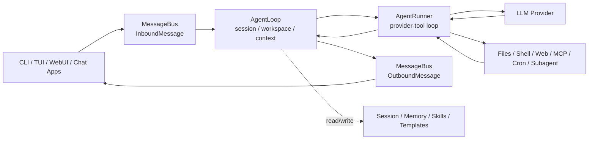

# learn-nanobot-2026

> 一份面向 **2026 年 Agent / AI 应用 / AI 平台实习** 的 Nanobot 学习仓库。
>
> 本仓库以 **2026-09-24 的 `HKUDS/nanobot` `main`** 为学习基线。第 1-11 章直接复用原版 `learn-nanobot` 的章节架构和仍然有效的正文，只改动与 current-source 不符的 Nanobot 实现细节；第 12 章替换为定制 ResearchPilot Capstone；第 13-14 章保留原版对后端/Agent 求职仍有价值的内容，并补充 2026-09 的 current-source 与工程实践。第 15-17 章保持原版。

## 这份仓库为谁准备

这不是零基础 Python 教程。默认学习者已经有：

- Java / 后端基础，能看懂 API、线程/并发、配置、日志；
- 一定算法和计算机基础；
- 已经做过 Agent Loop / Tool Calling / Context / Session / Memory 的最小实验；
- 已经做过一个 RAG 原型，理解 Parsing → Chunking → Embedding → Retrieval → Generation → Citation；
- 当前目标是 **尽快拿到 Agent 开发 / AI 应用 / AI 平台 / AI 后端方向实习**。

因此，本仓库的重点不是“背框架 API”，而是：

1. **读懂 current-source 的真实运行链路**；
2. **自己改、自己测、自己定位问题**；
3. **做一个能写进简历并经得住追问的 Capstone**；
4. **建立 Eval / Bad Case / Trace 思维**，避免停留在 Demo 层。

## Source of truth

学习时按下面优先级判断“谁说了算”：

1. `HKUDS/nanobot` 当前 `main` 源码；
2. `HKUDS/nanobot/docs/` 当前文档；
3. 本仓库；
4. 旧教程、旧 issue、博客、视频。

Nanobot 变化较快，本仓库固定的是 **2026-09-24 学习快照**，不是永远不变的 API 文档。开始学习前先运行：

```powershell
python .\scripts\snapshot_check.py
```

并查看 [`UPSTREAM_SNAPSHOT.md`](./UPSTREAM_SNAPSHOT.md)。

## 2026-09-24 的核心运行模型



当前最值得掌握的分层：

- `AgentLoop`：面向 channel 的一次 turn，负责 session、workspace、context、出站消息等产品层编排；
- `AgentRunner`：面向模型的一次 provider/tool loop，负责流式输出、tool call、tool result 回填、终止条件；
- `ContextBuilder`：把 project instructions、agent profile/memory、skills、history、current input 组装为模型上下文；
- `Session + AutoCompact + Consolidator`：管理近期对话和压缩；
- `Dream`：把长期积累重新整理进 `SOUL.md` / `USER.md` / `memory/MEMORY.md`；
- `ToolRegistry`：统一工具发现与模型可调用 schema；
- `MCPProvider`：由应用 composition root 管理连接生命周期，而不是让 `AgentLoop` 自己 connect/close；
- `Gateway`：长期运行的 channels、WebUI/WebSocket、automations、Dream、heartbeat 的宿主。

## 学习路线

### Phase 1：Current-source 基础与源码

| 章 | 内容 | 产出 |
|---|---|---|
| 01 | Agent 基础，但只保留面试真正需要的部分 | 能解释 Agent Loop / Tool / Context / Eval |
| 02 | 2026 Nanobot 全景 | 画出 current runtime map |
| 03 | 架构深入 | 说清 `AgentLoop` vs `AgentRunner` |
| 04 | 源码走读 | 从 inbound message 跟到 final answer |
| 05 | MCP | 理解 protocol、lifecycle、security boundary |

### Phase 2：动手实践

| 章 | 内容 | 产出 |
|---|---|---|
| 06 | current source 安装、config/workspace/session | 本机跑通 `main` |
| 07 | Session / AutoCompact / Consolidation / Dream | 跨 session memory 实验 |
| 08 | Tools / Skills / Agent Plugins | 自定义 Skill + Plugin |
| 09 | 多平台接入 | MessageBus / ChannelManager / Pairing / Feishu Long Connection |
| 10 | Subagent / Cron / Heartbeat | 后台任务、定时任务、Local Trigger 与 current Heartbeat |

### Phase 3：项目实战

| 章 | 内容 | 产出 |
|---|---|---|
| 11 | Security / Deploy | Workspace Guard、Sandbox、SSRF、Pairing、Gateway 部署 |
| 12 | 定制 Capstone：ResearchPilot | Nanobot × MCP × Multi-paper RAG × Eval × Backend Engineering |

### Phase 4：求职冲刺

| 章 | 内容 | 产出 |
|---|---|---|
| 13 | Current-source 面试题 | 不背旧架构答案 |
| 14 | 岗位技能映射 | 知道投什么、不投什么 |
| 15 | 简历模板 | 只写真实做过和测过的数据 |
| 16 | STAR 话术 | 3 分钟项目陈述 + 深挖问题 |
| 17 | 学习资源 | 官方文档、源码、协议、Eval |

## 目录

```text
learn-nanobot-2026/
├── README.md
├── UPSTREAM_SNAPSHOT.md
├── CURRICULUM.md
├── CHANGELOG.md
├── LICENSE
├── docs/
│   ├── 01-what-is-agent/
│   ├── 02-nanobot-overview/
│   ├── 03-architecture-deep-dive/
│   ├── 04-source-code-walkthrough/
│   ├── 05-mcp-protocol/
│   ├── 06-install-and-hands-on/
│   ├── 07-memory-system/
│   ├── 08-skills-and-tools/
│   ├── 09-multi-platform/
│   ├── 10-subagent-and-cron/
│   ├── 11-security-and-deploy/
│   ├── 12-nanobot-real-projects/
│   ├── 13-interview-bagua/
│   ├── 14-job-market-analysis/
│   ├── 15-resume-template/
│   ├── 16-star-interview/
│   └── 17-learning-resources/
├── projects/
│   ├── 01-runtime-trace-lab/
│   ├── 02-memory-dream-lab/
│   ├── 03-research-plugin/
│   └── 04-research-agent-capstone/
├── prompts/
│   ├── codex-source-trace.md
│   └── codex-minimal-experiment.md
└── scripts/
    └── snapshot_check.py
```

## 你的学习原则

本仓库默认用 **Vibe Coding + Source Reading**，但不允许把“Codex 写出来了”等同于“你会了”。每个实验必须能回答：

- 入口在哪里？
- 数据结构是什么？
- 调用链是什么？
- 状态存在哪里？
- 为什么这样设计？
- 错了从哪一层开始定位？
- 这个结果怎么测？

每章尽量只推进一个变量；不要在一个实验里同时加入 RAG、MCP、Subagent、Reranker、WebUI 和部署。

## 推荐节奏

如果目标是尽快找实习，不需要等全部学完再投。

- Day 1-2：03/04 current-source 调用链；
- Day 3：06 runtime/config/workspace/session；
- Day 4：07 memory + Dream；
- Day 5：08 Skill / Plugin；
- Day 6：09 MCP；
- Day 7：10 Gateway / Channel / Subagent / Automation；
- Day 8-11：12 Research Agent Capstone；
- Day 12：Eval / Bad Case / 指标；
- Day 13：部署 / Security / Observability；
- Day 14：简历、README、集中投递。

## 重要：不要抄简历数字

本仓库所有简历示例中的 `[YOUR_METRIC]` 都必须由你自己实验得到。禁止把示例中的命中率、延迟、成本、工具成功率当成自己的结果。

## Upstream

- Nanobot: https://github.com/HKUDS/nanobot
- Official docs: https://github.com/HKUDS/nanobot/tree/main/docs
- Original learning-repo inspiration: https://github.com/bcefghj/learn-nanobot

本仓库第 1-11、13-14 章以原版 `learn-nanobot` 正文为基础进行 current-source 校正与补充；第 12 章为定制项目。所有 Nanobot 源码结论以 2026-09-24 的 `HKUDS/nanobot` `main` 为准。
