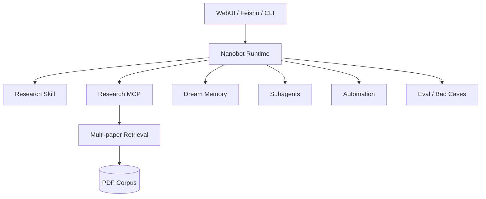

# 12 — Capstone：Nanobot × Research Agent

## 为什么用这个项目

你已经有网络测量 / Sketch 研究背景，又做过 Multi-paper RAG。与其重新做一个千篇一律客服 Bot，不如把已有积累变成 Agent runtime 上的真实 capability。

项目目标：

> 构建一个基于 Nanobot current-source 的科研文献 Agent，支持多论文检索、证据引用、跨论文综合、长期研究偏好记忆、Subagent 并行分析与后台自动化。

## Architecture



## Milestone 1：Tool 化已有 Retrieval

复用已有：

```text
PyMuPDF4LLM
sentence-aware chunking
BGE embedding
cosine similarity
document-aware retrieval
source metadata
```

先不要引入 vector DB。

## Milestone 2：MCP + Plugin

把 retrieval 包成 Research MCP，再与 Skill 打包为 Agent Plugin。

## Milestone 3：Grounded answer

强制保留 provenance：

```text
claim
→ Source N
→ doc_id / page / chunk_id
```

## Milestone 4：Memory

让 Dream 记：

- 稳定研究方向；
- 常用术语；
- 长期项目事实；

不要记：

- 每次检索结果；
- 临时 query；
- 大段论文原文。

## Milestone 5：Subagent

只在任务天然可并行时用：

```text
subagent A → Method
subagent B → Evaluation
subagent C → Limitations
main → synthesis
```

## Milestone 6：Automation

示例：

- 每周一汇总新加入 corpus 的论文；
- index rebuild 完成后 local trigger 通知 Agent；
- heartbeat 检查未处理论文，但无变化不打扰。

## Milestone 7：Eval

建立 multi-paper eval set，而不是围绕一篇论文调 5 道题。

至少评：

```text
Document Recall@K
Evidence/Passage Recall@K
Answer correctness
Citation support / citation precision
Unanswerable refusal
Tool success rate
Latency
```

再维护：

```text
bad_cases.jsonl
```

字段：query、expected、retrieved、answer、failure_stage、notes。

## 不建议为了“显得高级”硬加

- 多 Agent swarm；
- knowledge graph；
- 5 个向量数据库；
- 自研 planner；
- RL；

除非真实 eval 说明需要。

## 最终 README 应展示

1. 项目问题；
2. 架构图；
3. 为什么选 Nanobot；
4. 你改了什么；
5. RAG/Eval 数据；
6. 3 个 bad cases；
7. 安全边界；
8. 一键运行命令；
9. Demo GIF/截图；
10. 未来工作。

## 可写简历的前提

只有当你亲自完成并能回答源码追问时，才把 corresponding bullet 写入简历。
